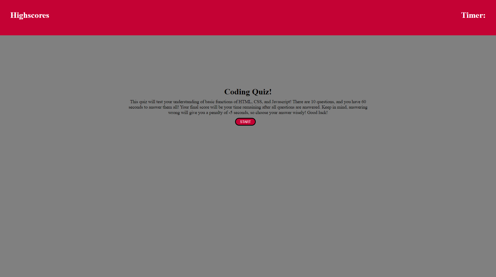

# JS-Quiz

## Description

This Coding Quiz can test your knowledge on basic fundamentals of HTML, JavaScript, and CSS. There are 10 questions. If a question is answered correctly, a message will display correct. If answereed incorrectly, a message will display incorrect and 5 seconds will be deducted from the time. The final timer value is your score.

## Contents

1.  [Deployed Page](#deployed-page)
2.  [Credits](#credits)

## Deployed Page

[Deployed Github Page](https://garretta01.github.io/JS-Quiz/)

## Credits

- Wepbage built by Garrett Anderson
